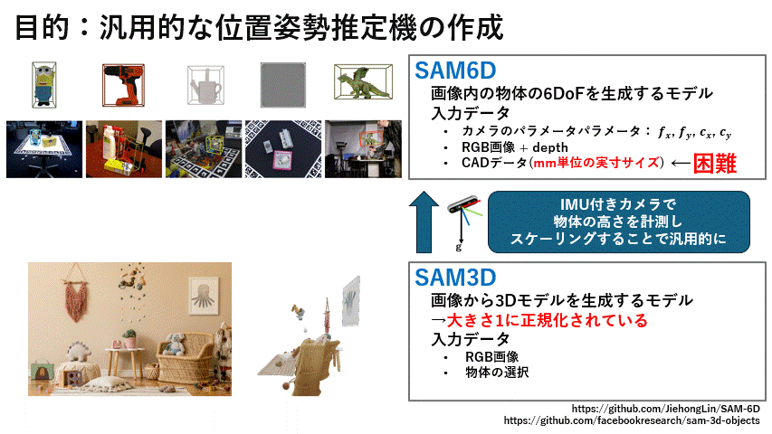

# SAM3D_6DoF

RGB-D カメラで物体を撮影し、GPU サーバ上で 3D 再構築と 6DoF 姿勢推定を行うパイプラインです。  
テンプレート CAD モデル不要・クリックひとつで物体の 6DoF 姿勢 (R, t) を取得できます。



---

## 概要

```
クライアント (ローカル PC / Windows)
  ↓ RGB + Depth 送信 (HTTP :8080)
サーバ (GPU 計算機 Linux)
  ├─ server.py        ← SAM2 マスク + SAM-3D メッシュ生成
  └─ SAM-6D Docker    ← テンプレートレンダリング + 6DoF 姿勢推定
  ↓ R, t 返却
クライアント
  └─ 把持姿勢生成 (Shape2Gesture) → ロボット送信
```

| コンポーネント | 役割 |
|---|---|
| [SAM2](https://github.com/facebookresearch/segment-anything-2) | クリック点から物体マスクを生成 |
| [SAM-3D](https://github.com/Pointcept/SAM-3D) | マスク内の RGB から 3D Gaussian Splat → PLY メッシュを生成 |
| [SAM-6D](https://github.com/JiehongLin/SAM-6D) | テンプレートマッチングで 6DoF 姿勢 (R, t) を推定 |

---

## ディレクトリ構成

```
SAM3D_6DoF/
├── server/                    # GPU 計算機側
│   ├── server.py              # メインサーバ (FastAPI, port 8080)
│   ├── sam6d_service.py       # SAM-6D マイクロサービス (Docker, port 8081)
│   ├── sam6d_wrapper.py       # SAM-6D Python ラッパー
│   ├── docker-compose.yml     # Docker 設定
│   └── Dockerfile.sam6d       # SAM-6D Docker イメージ定義
├── client/                    # ローカル PC 側
│   ├── test_demo.py           # テスト用エントリポイント (静止画ファイル)
│   ├── main.py                # メインエントリポイント (RealSense カメラ)
│   ├── config.yaml            # 設定ファイル (サーバ URL, カメラパラメータ等)
│   ├── pipeline/
│   │   ├── sam6d_detector.py  # SAM-6D クライアント (HTTP)
│   │   └── sam3d_segmentation.py  # SAM-3D クライアント (HTTP)
│   └── utils/
│       ├── coord_transform.py # 座標変換ユーティリティ
│       └── visualization.py   # 姿勢・点群の可視化
├── gif/
│   └── 2026_326.gif           # デモ動画
└── howto.txt                  # 起動手順メモ
```

---

## セットアップ

### 前提条件

| 環境 | 要件 |
|---|---|
| サーバ | Linux, NVIDIA GPU (VRAM 16 GB 以上推奨), Docker, CUDA |
| クライアント | Windows / Linux, Python 3.9+, (RealSense SDK) |

### サーバ側セットアップ

```bash
# 1. リポジトリを展開 (サブモジュールごと)
git clone <このリポジトリ>
cd SAM3D_6DoF
git submodule update --init --recursive

# 2. SAM-6D Docker イメージをビルド (初回のみ)
cd server
docker compose build sam6d
```

### モデル重みのダウンロード

**重みファイルはリポジトリに含まれていません。** 以下の手順で取得してください。

#### 1. SAM2 Large (server.py が使用)

```bash
wget https://dl.fbaipublicfiles.com/segment_anything_2/092824/sam2.1_hiera_large.pt
```

任意の場所に置き、`--sam-checkpoint <パス>` で指定します。

#### 2. SAM ViT-H (SAM-6D ISM が使用)

```bash
wget -P server/SAM-6D/SAM-6D/Instance_Segmentation_Model/ \
  https://dl.fbaipublicfiles.com/segment_anything/sam_vit_h_4b8939.pth
```

配置先: `server/SAM-6D/SAM-6D/Instance_Segmentation_Model/sam_vit_h_4b8939.pth`

#### 3. SAM-6D PEM checkpoint (SAM-6D 姿勢推定モデル)

```bash
mkdir -p server/SAM-6D/SAM-6D/Pose_Estimation_Model/checkpoints
wget -P server/SAM-6D/SAM-6D/Pose_Estimation_Model/checkpoints/ \
  https://huggingface.co/JiehongLin/SAM-6D/resolve/main/SAM-6D/Pose_Estimation_Model/checkpoints/sam-6d-pem-base.pth
```

配置先: `server/SAM-6D/SAM-6D/Pose_Estimation_Model/checkpoints/sam-6d-pem-base.pth`

#### 4. SAM-3D checkpoints (sam-3d-objects)

HuggingFace の [facebook/sam-3d-objects](https://huggingface.co/facebook/sam-3d-objects) からダウンロードします。  
> **注意**: アクセス申請 (氏名・生年月日・所属) が必要です。承認後にダウンロード可能になります。

```bash
# 1. HuggingFace 認証
pip install 'huggingface-hub[cli]<1.0'
hf auth login

# 2. チェックポイントをダウンロード (sam-3d-objects ディレクトリ内で実行)
cd server/sam-3d-objects
hf download --repo-type model \
    --local-dir checkpoints/hf-download \
    --max-workers 1 \
    facebook/sam-3d-objects
mv checkpoints/hf-download/checkpoints checkpoints/hf
rm -rf checkpoints/hf-download
```

配置先: `server/sam-3d-objects/checkpoints/hf/pipeline.yaml` (+ モデル重み)

#### 重みファイルの配置まとめ

```
SAM3D_6DoF/                                 ← このリポジトリのルート
└── server/
    ├── sam2.1_hiera_large.pt               ← SAM2 Large (任意の場所でも可)
    ├── sam-3d-objects/
    │   └── checkpoints/hf/
    │       └── pipeline.yaml (+ 重み)      ← SAM-3D
    └── SAM-6D/
        └── SAM-6D/
            ├── Instance_Segmentation_Model/
            │   └── sam_vit_h_4b8939.pth    ← SAM ViT-H (ISM)
            └── Pose_Estimation_Model/
                └── checkpoints/
                    └── sam-6d-pem-base.pth ← SAM-6D PEM
```

### クライアント側セットアップ

```bash
cd client
pip install -r requirements.txt
```

---

## 使い方

### STEP 1: サーバ側 — SAM-6D Docker を起動

```bash
cd server
docker compose up -d sam6d

# 起動確認 (モデルロードに 1〜2 分かかる)
docker logs -f sam6d_service
curl http://localhost:8081/health
# → {"status":"ok","models_loaded":true} が返れば OK
```

### STEP 2: サーバ側 — server.py を起動

```bash
cd server
python server.py \
    --sam-checkpoint <SAM2チェックポイントのパス> \
    --sam3d-config   sam-3d-objects/checkpoints/hf/pipeline.yaml \
    --sam3d-repo     sam-3d-objects \
    --sam6d-service  http://localhost:8081 \
    --host 0.0.0.0 --port 8080

# バックグラウンドで実行する場合
nohup python server.py \
    --sam-checkpoint <SAM2チェックポイントのパス> \
    --sam3d-config   sam-3d-objects/checkpoints/hf/pipeline.yaml \
    --sam3d-repo     sam-3d-objects \
    --sam6d-service  http://localhost:8081 \
    --host 0.0.0.0 --port 8080 > server.log 2>&1 &
```

### STEP 3: クライアント側 — テスト実行

```bash
cd client

# データフォルダを指定して実行 (ウィンドウで物体をクリック選択)
python test_demo.py --data_dir demo_data/demo1

# クリック座標を手動指定してヘッドレス実行
python test_demo.py --data_dir demo_data/demo1 \
    --click-x 320 --click-y 240 --no-show

# 重力ベクトルを手動指定 (cam.json に gravity がない場合)
python test_demo.py --data_dir demo_data/demo1 \
    --gravity 0 -1 0

# 出力先: client/output/<timestamp>/
#   pose_check_pts.png       … 点群+bbox の投影結果
#   pose_check_bbox_axis.png … bbox + 座標軸の投影結果
#   server_pointcloud.png    … サーバ側点群可視化
#   server_mesh.png          … サーバ側メッシュ可視化
#   sam_mask.png             … SAM マスクオーバーレイ
#   height_estimation.png    … 高さ推定点群可視化
```

#### データフォルダ構成

```
demo_data/demo1/
├─ rgb.png        カラー画像
├─ depth.png      深度画像 (uint16, mm 単位)
└─ cam.json       カメラパラメータ
```

`cam.json` の例:
```json
{
    "cam_K": [fx, 0, cx, 0, fy, cy, 0, 0, 1],
    "depth_scale": 0.001,
    "gravity": [0.0, -0.999, 0.04]
}
```
> `gravity` フィールドは省略可。省略した場合は RealSense IMU から自動取得、または `--gravity` オプションで手動指定。

---

## 設定ファイル (`client/config.yaml`)

主要な設定項目:

```yaml
sam3d:
  server_url: "http://10.40.1.126:8080"   # ← サーバの IP アドレスを変更
  mesh_method: "knn"                       # メッシュ生成方式: bpa / poisson / knn

robot:
  mode: "mock"   # mock (デバッグ) / tcp / ros / serial
```

---

## API エンドポイント (server.py)

| エンドポイント | メソッド | 説明 |
|---|---|---|
| `/health` | GET | サーバ状態確認 |
| `/reconstruct_mesh` | POST | RGB → SAM2 マスク → SAM-3D メッシュ生成 + SAM-6D テンプレートレンダリング |
| `/pose_estimate` | POST | RGB + depth → SAM2 マスク → SAM-6D 6DoF 姿勢推定 |

---

## オプション一覧 (`test_demo.py`)

| オプション | 説明 |
|---|---|
| `--data_dir <フォルダ>` | データフォルダ (rgb.png / depth.png / cam.json を含む) **[必須]** |
| `--click-x / --click-y` | 物体指定クリック座標 (省略するとウィンドウでクリック選択) |
| `--gravity GX GY GZ` | 重力方向ベクトル手動指定 (cam.json の gravity より優先) |
| `--no-show` | `cv2.imshow` を使わない (SSH / ヘッドレス環境用) |
| `--mesh-out <パス>` | メッシュ保存先 PLY パス (デフォルト: `meshes/test_object.ply`) |
| `--imu-samples <N>` | IMU から重力取得するサンプル数 (デフォルト: 30) |
| `--config <パス>` | 設定ファイルパス (デフォルト: `config.yaml`) |

---

## 既知の制限

- **スケール不一致**: SAM-3D は単眼 RGB から再構築するためスケールが不定。サーバ側でメッシュの最長辺を 200 mm に正規化して補正しているが、実物と完全には一致しない。
- **モデルロード時間**: サーバ起動後、SAM-6D Docker のモデルロードに 1〜2 分かかる。
